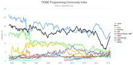

<p><strong>Java</strong>&nbsp;is a&nbsp;<a title="" href="https://en.wikipedia.org/wiki/General-purpose_language">general-purpose</a>&nbsp;<a title="Programming language" href="https://en.wikipedia.org/wiki/Programming_language">programming language</a>&nbsp;that is&nbsp;<a title="Class-based programming" href="https://en.wikipedia.org/wiki/Class-based_programming">class-based</a>,&nbsp;<a title="Object-oriented programming" href="https://en.wikipedia.org/wiki/Object-oriented_programming">object-oriented</a>, and designed to have as few implementation&nbsp;<a class="mw-redirect" title="Dependency (computer science)" href="https://en.wikipedia.org/wiki/Dependency_(computer_science)">dependencies</a>&nbsp;as possible. It is intended to let&nbsp;<a class="mw-redirect" title="Application developer" href="https://en.wikipedia.org/wiki/Application_developer">application developers</a>&nbsp;<em>write once, run anywhere</em>&nbsp;(WORA),&nbsp;meaning that&nbsp;<a title="Compiler" href="https://en.wikipedia.org/wiki/Compiler">compiled</a>&nbsp;Java code can run on all platforms that support Java without the need for recompilation.&nbsp;Java applications are typically compiled to&nbsp;<a title="Java bytecode" href="https://en.wikipedia.org/wiki/Java_bytecode">bytecode</a>&nbsp;that can run on any&nbsp;<a title="Java virtual machine" href="https://en.wikipedia.org/wiki/Java_virtual_machine">Java virtual machine</a>&nbsp;(JVM) regardless of the underlying&nbsp;<a title="Computer architecture" href="https://en.wikipedia.org/wiki/Computer_architecture">computer architecture</a>. The&nbsp;<a title="Syntax (programming languages)" href="https://en.wikipedia.org/wiki/Syntax_(programming_languages)">syntax</a>&nbsp;of&nbsp;<a title="Java (software platform)" href="https://en.wikipedia.org/wiki/Java_(software_platform)">Java</a>&nbsp;is similar to&nbsp;<a title="C (programming language)" href="https://en.wikipedia.org/wiki/C_(programming_language)">C</a>&nbsp;and&nbsp;<a title="C++" href="https://en.wikipedia.org/wiki/C%2B%2B">C++</a>, but it has fewer&nbsp;<a title="Low-level programming language" href="https://en.wikipedia.org/wiki/Low-level_programming_language">low-level</a>&nbsp;facilities than either of them. As of 2019, Java was one of the most&nbsp;<a title="Measuring programming language popularity" href="https://en.wikipedia.org/wiki/Measuring_programming_language_popularity">popular programming languages in use</a>&nbsp;according to&nbsp;<a title="GitHub" href="https://en.wikipedia.org/wiki/GitHub">GitHub</a>, particularly for&nbsp;<a class="mw-redirect" title="Client&ndash;server" href="https://en.wikipedia.org/wiki/Client%E2%80%93server">client-server</a>&nbsp;<a class="mw-redirect" title="Web applications" href="https://en.wikipedia.org/wiki/Web_applications">web applications</a>, with a reported 9 million developers.</p>
<p>Java was originally developed by&nbsp;<a title="James Gosling" href="https://en.wikipedia.org/wiki/James_Gosling">James Gosling</a>&nbsp;at&nbsp;<a title="Sun Microsystems" href="https://en.wikipedia.org/wiki/Sun_Microsystems">Sun Microsystems</a>&nbsp;(<a title="Sun acquisition by Oracle" href="https://en.wikipedia.org/wiki/Sun_acquisition_by_Oracle">which has since been acquired by Oracle</a>) and released in 1995 as a core component of Sun Microsystems'&nbsp;<a title="Java (software platform)" href="https://en.wikipedia.org/wiki/Java_(software_platform)">Java platform</a>. The original and&nbsp;<a title="Reference implementation" href="https://en.wikipedia.org/wiki/Reference_implementation">reference implementation</a>&nbsp;Java&nbsp;<a title="Compiler" href="https://en.wikipedia.org/wiki/Compiler">compilers</a>, virtual machines, and&nbsp;<a title="Library (computing)" href="https://en.wikipedia.org/wiki/Library_(computing)">class libraries</a>&nbsp;were originally released by Sun under&nbsp;<a class="mw-redirect" title="Proprietary license" href="https://en.wikipedia.org/wiki/Proprietary_license">proprietary licenses</a>. As of May 2007, in compliance with the specifications of the&nbsp;<a title="Java Community Process" href="https://en.wikipedia.org/wiki/Java_Community_Process">Java Community Process</a>, Sun had&nbsp;<a title="Software relicensing" href="https://en.wikipedia.org/wiki/Software_relicensing">relicensed</a>&nbsp;most of its Java technologies under the&nbsp;<a title="GNU General Public License" href="https://en.wikipedia.org/wiki/GNU_General_Public_License">GNU General Public License</a>. Meanwhile, others have developed alternative implementations of these Sun technologies, such as the&nbsp;<a title="GNU Compiler for Java" href="https://en.wikipedia.org/wiki/GNU_Compiler_for_Java">GNU Compiler for Java</a>&nbsp;(bytecode compiler),&nbsp;<a title="GNU Classpath" href="https://en.wikipedia.org/wiki/GNU_Classpath">GNU Classpath</a>&nbsp;(standard libraries), and&nbsp;<a title="IcedTea" href="https://en.wikipedia.org/wiki/IcedTea">IcedTea</a>-Web (browser plugin for applets).</p>
<p>The latest versions are&nbsp;<a title="Java version history" href="https://en.wikipedia.org/wiki/Java_version_history">Java&nbsp;13</a>, released in September 2019, and Java&nbsp;11, a currently supported&nbsp;<a title="Long-term support" href="https://en.wikipedia.org/wiki/Long-term_support">long-term support</a>&nbsp;(LTS) version, released on September 25, 2018;&nbsp;<a title="Oracle Corporation" href="https://en.wikipedia.org/wiki/Oracle_Corporation">Oracle</a>&nbsp;released for the&nbsp;<a title="Legacy system" href="https://en.wikipedia.org/wiki/Legacy_system">legacy</a>&nbsp;Java&nbsp;8&nbsp;LTS the last free public update in January 2019 for commercial use, while it will otherwise still support Java&nbsp;8 with public updates for personal use up to at least December 2020. Oracle (and others) highly recommend uninstalling older versions of Java because of serious risks due to unresolved security issues.&nbsp;Since Java&nbsp;9 (and 10 and 12) is no longer supported, Oracle advises its users to immediately transition to the latest version (currently Java 13) or an LTS release.</p>

</br>

<table class="infobox vevent">
<tbody>
<tr>
<td colspan="2"><a class="image" href="Java_programming_language.png"></a></td>
</tr>
<tr>
<th scope="row"><a title="Programming paradigm" href="https://en.wikipedia.org/wiki/Programming_paradigm">Paradigm</a></th>
<td><a title="Programming paradigm" href="https://en.wikipedia.org/wiki/Programming_paradigm#Multi-paradigm">Multi-paradigm</a>:&nbsp;<a title="Generic programming" href="https://en.wikipedia.org/wiki/Generic_programming">generic</a>,&nbsp;<a class="mw-redirect" title="Object-oriented" href="https://en.wikipedia.org/wiki/Object-oriented">object-oriented</a>&nbsp;(<a title="Class-based programming" href="https://en.wikipedia.org/wiki/Class-based_programming">class-based</a>),&nbsp;<a title="Imperative programming" href="https://en.wikipedia.org/wiki/Imperative_programming">imperative</a>,&nbsp;<a title="Reflection (computer programming)" href="https://en.wikipedia.org/wiki/Reflection_(computer_programming)">reflective</a></td>
</tr>
<tr>
<th scope="row"><a title="Software design" href="https://en.wikipedia.org/wiki/Software_design">Designed&nbsp;by</a></th>
<td><a title="James Gosling" href="https://en.wikipedia.org/wiki/James_Gosling">James Gosling</a></td>
</tr>
<tr>
<th scope="row"><a class="mw-redirect" title="Software developer" href="https://en.wikipedia.org/wiki/Software_developer">Developer</a></th>
<td class="organiser"><a title="Sun Microsystems" href="https://en.wikipedia.org/wiki/Sun_Microsystems">Sun Microsystems</a></td>
</tr>
<tr>
<th scope="row">First&nbsp;appeared</th>
<td>May&nbsp;23, 1995<span class="noprint">; 24 years ago</span></td>
</tr>
<tr>
<td colspan="2">&nbsp;</td>
</tr>
<tr>
<th scope="row"><a title="Software release life cycle" href="https://en.wikipedia.org/wiki/Software_release_life_cycle">Stable release</a></th>
<td>
<div>Java SE 13 / September&nbsp;17, 2019<span class="noprint">; 5 months ago</span></div>
</td>
</tr>
<tr>
<th scope="row"><a title="Type system" href="https://en.wikipedia.org/wiki/Type_system">Typing discipline</a></th>
<td><a title="Type system" href="https://en.wikipedia.org/wiki/Type_system">Static, strong, safe</a>,&nbsp;<a title="Nominal type system" href="https://en.wikipedia.org/wiki/Nominal_type_system">nominative</a>,&nbsp;<a title="Manifest typing" href="https://en.wikipedia.org/wiki/Manifest_typing">manifest</a></td>
</tr>
<tr>
<th scope="row"><a title="Filename extension" href="https://en.wikipedia.org/wiki/Filename_extension">Filename extensions</a></th>
<td>.java,&nbsp;<a title="Java class file" href="https://en.wikipedia.org/wiki/Java_class_file">.class</a>,&nbsp;<a title="JAR (file format)" href="https://en.wikipedia.org/wiki/JAR_(file_format)">.jar</a></td>
</tr>
<tr>
<th scope="row">Website</th>
<td><span class="url"><a class="external text" href="http://oracle.com/java/" rel="nofollow">oracle<wbr />.com<wbr />/java<wbr />/</a></span></td>
</tr>
<tr>
<th colspan="2">Influenced by</th>
</tr>
<tr>
<td colspan="2"><a title="Ada (programming language)" href="https://en.wikipedia.org/wiki/Ada_(programming_language)">Ada 83</a>,&nbsp;<a title="C++" href="https://en.wikipedia.org/wiki/C%2B%2B">C++</a>,&nbsp;<a title="C Sharp (programming language)" href="https://en.wikipedia.org/wiki/C_Sharp_(programming_language)">C#</a>,&nbsp;<a title="Eiffel (programming language)" href="https://en.wikipedia.org/wiki/Eiffel_(programming_language)">Eiffel</a>,&nbsp;<a title="Mesa (programming language)" href="https://en.wikipedia.org/wiki/Mesa_(programming_language)">Mesa</a>,&nbsp;<a title="Modula-3" href="https://en.wikipedia.org/wiki/Modula-3">Modula-3</a>,&nbsp;<a title="Oberon (programming language)" href="https://en.wikipedia.org/wiki/Oberon_(programming_language)">Oberon</a>,&nbsp;<a title="Objective-C" href="https://en.wikipedia.org/wiki/Objective-C">Objective-C</a>,&nbsp;<a title="UCSD Pascal" href="https://en.wikipedia.org/wiki/UCSD_Pascal">UCSD Pascal</a>,&nbsp;<a title="Object Pascal" href="https://en.wikipedia.org/wiki/Object_Pascal">Object Pascal</a></td>
</tr>
<tr>
<th colspan="2">Influenced</th>
</tr>
<tr>
<td colspan="2">
<p><a title="Ada (programming language)" href="https://en.wikipedia.org/wiki/Ada_(programming_language)">Ada 2005</a>,&nbsp;<a title="BeanShell" href="https://en.wikipedia.org/wiki/BeanShell">BeanShell</a>,&nbsp;<a title="C Sharp (programming language)" href="https://en.wikipedia.org/wiki/C_Sharp_(programming_language)">C#</a>,&nbsp;<a title="Chapel (programming language)" href="https://en.wikipedia.org/wiki/Chapel_(programming_language)">Chapel</a>,&nbsp;<a title="Clojure" href="https://en.wikipedia.org/wiki/Clojure">Clojure</a>,&nbsp;<a title="ECMAScript" href="https://en.wikipedia.org/wiki/ECMAScript">ECMAScript</a>,&nbsp;<a title="Fantom (programming language)" href="https://en.wikipedia.org/wiki/Fantom_(programming_language)">Fantom</a>,&nbsp;<a title="Gambas" href="https://en.wikipedia.org/wiki/Gambas">Gambas</a>,&nbsp;<a class="mw-redirect" title="Groovy (programming language)" href="https://en.wikipedia.org/wiki/Groovy_(programming_language)">Groovy</a>,&nbsp;</p>
<p><a title="Hack (programming language)" href="https://en.wikipedia.org/wiki/Hack_(programming_language)">Hack</a>,&nbsp;<a class="mw-redirect" title="Haxe (programming language)" href="https://en.wikipedia.org/wiki/Haxe_(programming_language)">Haxe</a>,&nbsp;<a title="J Sharp" href="https://en.wikipedia.org/wiki/J_Sharp">J#</a>,&nbsp;<a title="Kotlin (programming language)" href="https://en.wikipedia.org/wiki/Kotlin_(programming_language)">Kotlin</a>,&nbsp;<a title="PHP" href="https://en.wikipedia.org/wiki/PHP">PHP</a>,&nbsp;<a title="Python (programming language)" href="https://en.wikipedia.org/wiki/Python_(programming_language)">Python</a>,&nbsp;<a title="Scala (programming language)" href="https://en.wikipedia.org/wiki/Scala_(programming_language)">Scala</a>,&nbsp;<a title="Seed7" href="https://en.wikipedia.org/wiki/Seed7">Seed7</a>,&nbsp;<a title="Vala (programming language)" href="https://en.wikipedia.org/wiki/Vala_(programming_language)">Vala</a></p>
</td>
</tr>
<tr>
<td class="hlist" colspan="2">
<p><a class="image" href="logo.png"></a>&nbsp;<a class="extiw" title="wikibooks:Java Programming" href="https://en.wikibooks.org/wiki/Java_Programming">Java Programming</a>&nbsp;at Wikibooks</p>
</td>
</tr>
</tbody>
</table>

</br>


<div class="toctitle" dir="ltr" lang="en"></div>
<h2>Contents</h2>
<label class="toctogglelabel" for="toctogglecheckbox"></label></div>
<ul>
<li class="toclevel-1 tocsection-1"><a href="#History"><span class="toctext">History</span></a>
<ul>
<li class="toclevel-2 tocsection-2"><a href="#Principles"><span class="toctext">Principles</span></a></li>
<li class="toclevel-2 tocsection-3"><a href="#Versions"><span class="toctext">Versions</span></a></li>
</ul>
</li>
<li class="toclevel-1 tocsection-4"><a href="#Editions"><span class="toctext">Editions</span></a></li>
<li class="toclevel-1 tocsection-5"><a href="#Execution_system"><span class="toctext">Execution system</span></a>
<ul>
<li class="toclevel-2 tocsection-6"><a href="#Java_JVM_and_Bytecode"><span class="toctext">Java JVM and Bytecode</span></a>
<ul>
<li class="toclevel-3 tocsection-7"><a href="#Performance"><span class="toctext">Performance</span></a></li>
</ul>
</li>
<li class="toclevel-2 tocsection-8"><a href="#Non-JVM"><span class="toctext">Non-JVM</span></a></li>
<li class="toclevel-2 tocsection-9"><a href="#Automatic_memory_management"><span class="toctext">Automatic memory management</span></a></li>
</ul>
</li>
<li class="toclevel-1 tocsection-10"><a href="#Syntax"><span class="toctext">Syntax</span></a>
<ul>
<li class="toclevel-2 tocsection-11"><a href="#Hello_world_example"><span class="toctext">Hello world example</span></a></li>
<li class="toclevel-2 tocsection-12"><a href="#Example_with_methods"><span class="toctext">Example with methods</span></a></li>
</ul>
</li>
<li class="toclevel-1 tocsection-13"><a href="#Special_classes"><span class="tocnumber">5</span><span class="toctext">Special classes</span></a>
<ul>
<li class="toclevel-2 tocsection-14"><a href="#Applet"><span class="toctext">Applet</span></a></li>
<li class="toclevel-2 tocsection-15"><a href="#Servlet"><span class="toctext">Servlet</span></a></li>
<li class="toclevel-2 tocsection-16"><a href="#JavaServer_Pages"><span class="toctext">JavaServer Pages</span></a></li>
<li class="toclevel-2 tocsection-17"><a href="#Swing_application"><span class="toctext">Swing application</span></a></li>
<li class="toclevel-2 tocsection-18"><a href="#JavaFX_application"><span class="toctext">JavaFX application</span></a></li>
<li class="toclevel-2 tocsection-19"><a href="#Generics"><span class="toctext">Generics</span></a></li>
</ul>
</li>
<li class="toclevel-1 tocsection-20"><a href="#Criticism"><span class="toctext">Criticism</span></a></li>
<li class="toclevel-1 tocsection-21"><a href="#Class_libraries"><span class="toctext">Class libraries</span></a></li>
<li class="toclevel-1 tocsection-22"><a href="#Documentation"><span class="toctext">Documentation</span></a></li>
<li class="toclevel-1 tocsection-23"><a href="#Implementations"><span class="toctext">Implementations</span></a></li>
<li class="toclevel-1 tocsection-24"><a href="#Use_outside_the_Java_platform"><span class="toctext">Use outside the Java platform</span></a>
<ul>
<li class="toclevel-2 tocsection-25"><a href="#Android"><span class="toctext">Android</span></a>
<ul>
<li class="toclevel-3 tocsection-26"><a href="#Controversy"><span class="toctext">Controversy</span></a></li>
</ul>
</li>
    
    
</ul>
</li>
<li class="toclevel-3 tocsection-26"><a href="#Beginner Java Exercises"><span class="toctext">Beginner Java Exercises</span></a></li>

</ul>

</br>

<h2><span id="History" class="mw-headline">History</span></h2>
<div class="hatnote navigation-not-searchable">&nbsp;</div>
<div class="thumb tright">
<div class="thumbinner"><a class="image" href="jos1.jpg"></a>
<div class="thumbcaption">
<div class="magnify">&nbsp;</div>
<a title="James Gosling" href="https://en.wikipedia.org/wiki/James_Gosling">James Gosling</a>, the creator of Java, in 2008</div>
<div class="thumbcaption">&nbsp;</div>
</div>
</div>


</br>
<h2>Publications </h2>
<ul>
 <li><a target="_blank" href="https://github.com/manjunath5496/Java-Tutorial/blob/master/jvk(1).pdf" style="text-decoration:none;">UNIX Emacs: A Retrospective</a></li>
                            
 <li><a target="_blank" href="https://github.com/manjunath5496/Java-Tutorial/blob/master/jvk(2).pdf" style="text-decoration:none;">The Feel of Java</a></li>

<li><a target="_blank" href="https://github.com/manjunath5496/Java-Tutorial/blob/master/jvk(3).pdf" style="text-decoration:none;">The Java Language Specification</a></li>
 <li><a target="_blank" href="https://github.com/manjunath5496/Java-Tutorial/blob/master/jvk(4).pdf" style="text-decoration:none;">The Real-Time Specification for Java</a></li>                              
<li><a target="_blank" href="https://github.com/manjunath5496/Java-Tutorial/blob/master/jvk(5).pdf" style="text-decoration:none;">The Java Programming Language</a></li>

<li><a target="_blank" href="https://github.com/manjunath5496/Java-Tutorial/blob/master/jvk(6).pdf" style="text-decoration:none;">A Conversation with James Gosling</a></li>
<li><a target="_blank" href="https://github.com/manjunath5496/Java-Tutorial/blob/master/jvk(7).pdf" style="text-decoration:none;">The Java Language Environment</a></li>
</ul>


</br></br>


<div class="thumb tright">
<div class="thumbinner"><a class="image" href="jos2.png"></a>
<div class="thumbcaption">
<div class="magnify">&nbsp;</div>
<b>The&nbsp;<a title="TIOBE index" href="https://en.wikipedia.org/wiki/TIOBE_index">TIOBE</a>&nbsp;<a title="Measuring programming language popularity" href="https://en.wikipedia.org/wiki/Measuring_programming_language_popularity">programming language popularity index</a>&nbsp;graph from 2002 to 2018. Java is steadily on the top since mid-2015.</b></div>
</div>
</div>
</br>
<p><a title="James Gosling" href="https://en.wikipedia.org/wiki/James_Gosling">James Gosling</a>, Mike Sheridan, and&nbsp;<a title="Patrick Naughton" href="https://en.wikipedia.org/wiki/Patrick_Naughton">Patrick Naughton</a>&nbsp;initiated the Java language project in June 1991.&nbsp;Java was originally designed for interactive television, but it was too advanced for the digital cable television industry at the time.&nbsp;The language was initially called&nbsp;<em><a title="Oak (programming language)" href="https://en.wikipedia.org/wiki/Oak_(programming_language)">Oak</a></em>&nbsp;after an&nbsp;<a title="Oak" href="https://en.wikipedia.org/wiki/Oak">oak</a>&nbsp;tree that stood outside Gosling's office. Later the project went by the name&nbsp;<em>Green</em>&nbsp;and was finally renamed&nbsp;<em>Java</em>, from&nbsp;<a class="mw-redirect" title="Java coffee" href="https://en.wikipedia.org/wiki/Java_coffee">Java coffee</a>, the coffee from&nbsp;<a title="Indonesia" href="https://en.wikipedia.org/wiki/Indonesia">Indonesia</a>.&nbsp;Gosling designed Java with a&nbsp;<a title="C (programming language)" href="https://en.wikipedia.org/wiki/C_(programming_language)">C</a>/<a title="C++" href="https://en.wikipedia.org/wiki/C%2B%2B">C++</a>-style syntax that system and application programmers would find familiar.</p>
<p>Sun Microsystems released the first public implementation as Java&nbsp;1.0 in 1996.&nbsp;It promised&nbsp;<strong>Write Once, Run Anywhere</strong>&nbsp;(WORA) functionality, providing no-cost run-times on popular&nbsp;<a title="Computing platform" href="https://en.wikipedia.org/wiki/Computing_platform">platforms</a>. Fairly secure and featuring configurable security, it allowed network- and file-access restrictions. Major&nbsp;<a title="Web browser" href="https://en.wikipedia.org/wiki/Web_browser">web browsers</a>&nbsp;soon incorporated the ability to run&nbsp;<a title="Java applet" href="https://en.wikipedia.org/wiki/Java_applet">Java applets</a>&nbsp;within web pages, and Java quickly became popular. The Java&nbsp;1.0 compiler was re-written&nbsp;<a title="Bootstrapping (compilers)" href="https://en.wikipedia.org/wiki/Bootstrapping_(compilers)">in Java</a>&nbsp;by&nbsp;<a title="Arthur van Hoff" href="https://en.wikipedia.org/wiki/Arthur_van_Hoff">Arthur van Hoff</a>&nbsp;to comply strictly with the Java&nbsp;1.0 language specification.&nbsp;With the advent of Java&nbsp;2 (released initially as J2SE&nbsp;1.2 in December 1998&nbsp;&ndash; 1999), new versions had multiple configurations built for different types of platforms. J2EE included technologies and APIs for enterprise applications typically run in server environments, while J2ME featured APIs optimized for mobile applications. The desktop version was renamed J2SE. In 2006, for marketing purposes, Sun renamed new J2 versions as&nbsp;<em><a title="Java Platform, Enterprise Edition" href="https://en.wikipedia.org/wiki/Java_Platform,_Enterprise_Edition">Java EE</a></em>,&nbsp;<em><a title="Java Platform, Micro Edition" href="https://en.wikipedia.org/wiki/Java_Platform,_Micro_Edition">Java ME</a></em>, and&nbsp;<em><a title="Java Platform, Standard Edition" href="https://en.wikipedia.org/wiki/Java_Platform,_Standard_Edition">Java SE</a></em>, respectively.</p>
<p>In 1997, Sun Microsystems approached the&nbsp;<a title="ISO/IEC JTC 1" href="https://en.wikipedia.org/wiki/ISO/IEC_JTC_1">ISO/IEC JTC 1</a>&nbsp;standards body and later the&nbsp;<a title="Ecma International" href="https://en.wikipedia.org/wiki/Ecma_International">Ecma International</a>&nbsp;to formalize Java, but it soon withdrew from the process. Java remains a&nbsp;<a title="De facto standard" href="https://en.wikipedia.org/wiki/De_facto_standard"><em>de facto</em>&nbsp;standard</a>, controlled through the&nbsp;<a title="Java Community Process" href="https://en.wikipedia.org/wiki/Java_Community_Process">Java Community Process</a>.<sup id="cite_ref-30" class="reference"><a href="https://en.wikipedia.org/wiki/Java_(programming_language)#cite_note-30">[30]</a></sup>&nbsp;At one time, Sun made most of its Java implementations available without charge, despite their&nbsp;<a title="Proprietary software" href="https://en.wikipedia.org/wiki/Proprietary_software">proprietary software</a>&nbsp;status. Sun generated revenue from Java through the selling of licenses for specialized products such as the Java Enterprise System.</p>
<p>On November 13, 2006, Sun released much of its Java virtual machine (JVM) as&nbsp;<a title="Free and open-source software" href="https://en.wikipedia.org/wiki/Free_and_open-source_software">free and open-source software</a>&nbsp;(FOSS), under the terms of the&nbsp;<a title="GNU General Public License" href="https://en.wikipedia.org/wiki/GNU_General_Public_License">GNU General Public License</a>&nbsp;(GPL). On May 8, 2007, Sun finished the process, making all of its JVM's core code available under&nbsp;<a title="Free software" href="https://en.wikipedia.org/wiki/Free_software">free software</a>/open-source distribution terms, aside from a small portion of code to which Sun did not hold the copyright.</p>
<p>Sun's vice-president Rich Green said that Sun's ideal role with regard to Java was as an&nbsp;<em>evangelist</em>.&nbsp;Following&nbsp;<a title="Oracle Corporation" href="https://en.wikipedia.org/wiki/Oracle_Corporation">Oracle Corporation</a>'s acquisition of Sun Microsystems in 2009&ndash;10, Oracle has described itself as the steward of Java technology with a relentless commitment to fostering a community of participation and transparency.&nbsp;This did not prevent Oracle from filing a lawsuit against Google shortly after that for using Java inside the&nbsp;<a class="mw-redirect" title="Android SDK" href="https://en.wikipedia.org/wiki/Android_SDK">Android SDK</a>&nbsp;(see the&nbsp;<em><a href="https://en.wikipedia.org/wiki/Java_(programming_language)#Android">Android</a></em>&nbsp;section). Java software runs on everything from laptops to&nbsp;<a title="Data center" href="https://en.wikipedia.org/wiki/Data_center">data centers</a>,&nbsp;<a title="Video game console" href="https://en.wikipedia.org/wiki/Video_game_console">game consoles</a>&nbsp;to scientific&nbsp;<a title="Supercomputer" href="https://en.wikipedia.org/wiki/Supercomputer">supercomputers</a>.&nbsp;On April 2, 2010, James Gosling resigned from&nbsp;<a title="Oracle Corporation" href="https://en.wikipedia.org/wiki/Oracle_Corporation">Oracle</a>.</p>
<p>In January 2016, Oracle announced that Java run-time environments based on JDK 9 will discontinue the browser plugin.</p>
<h3><span id="Principles" class="mw-headline">Principles</span></h3>
<p>There were five primary goals in the creation of the Java language:</p>
<blockquote>
<ol>
<li>It must be simple, object-oriented, and familiar.</li>
<li>It must be robust and secure.</li>
<li>It must be architecture-neutral and portable.</li>
<li>It must execute with high performance.</li>
<li>It must be interpreted, threaded, and dynamic.</li>
</ol>
</blockquote>
<h3><span id="Versions" class="mw-headline">Versions</span></h3>
<div class="hatnote navigation-not-searchable">&nbsp;</div>
<p>As of March&nbsp;2019, Java&nbsp;8 is supported; and both Java&nbsp;8 and 11 as Long Term Support (LTS) versions. Major release versions of Java, along with their release dates:</p>
<ul>
<li>JDK 1.0 (January 23, 1996)</li>
<li>JDK 1.1 (February 19, 1996)</li>
<li>J2SE 1.2 (December 8, 1998)</li>
<li>J2SE 1.3 (May 8, 2000)</li>
<li>J2SE 1.4 (February 6, 2002)</li>
<li>J2SE 5.0 (September 30, 2004)</li>
<li>Java SE 6 (December 11, 2006)</li>
<li>Java SE 7 (July 28, 2011)</li>
<li>Java SE 8 (March 18, 2014)</li>
<li>Java SE 9 (September 21, 2017)</li>
<li>Java SE 10 (March 20, 2018)</li>
<li>Java SE 11 (September 25, 2018)</li>
<li>Java SE 12 (March 19, 2019)</li>
<li>Java SE 13 (September 17, 2019)</li>
</ul>
<p>&nbsp;</p>

<h2><span id="Editions" class="mw-headline">Editions</span></h2>
<div class="hatnote navigation-not-searchable">
<table class="vertical-navbox nowraplinks">
<tbody>
<tr>
<th><a title="Java (software platform)" href="https://en.wikipedia.org/wiki/Java_(software_platform)">Java platform</a>&nbsp;editions</th>
</tr>
<tr>
<td>
<ul>
<li><a title="Java Card" href="https://en.wikipedia.org/wiki/Java_Card">Java Card</a></li>
<li><a title="Java Platform, Micro Edition" href="https://en.wikipedia.org/wiki/Java_Platform,_Micro_Edition">Micro Edition</a>&nbsp;(ME)</li>
<li><a title="Java Platform, Standard Edition" href="https://en.wikipedia.org/wiki/Java_Platform,_Standard_Edition">Standard Edition</a>&nbsp;(SE)</li>
<li><a title="Java Platform, Enterprise Edition" href="https://en.wikipedia.org/wiki/Java_Platform,_Enterprise_Edition">Enterprise Edition</a>&nbsp;(EE)</li>
<li><a title="JavaFX" href="https://en.wikipedia.org/wiki/JavaFX">JavaFX</a>&nbsp;(bundled in&nbsp;<a class="mw-redirect" title="JRE" href="https://en.wikipedia.org/wiki/JRE">JRE</a>&nbsp;from 8 to 10 but separately for JavaFX 1.x, 2.x and 11)</li>
<li><a title="PersonalJava" href="https://en.wikipedia.org/wiki/PersonalJava">PersonalJava</a>&nbsp;(Discontinued)</li>
</ul>
</td>
</tr>
</tbody>
</table>
</div>
<p>Sun has defined and supports four editions of Java targeting different application environments and segmented many of its&nbsp;<a title="Application programming interface" href="https://en.wikipedia.org/wiki/Application_programming_interface">APIs</a>&nbsp;so that they belong to one of the platforms. The platforms are:</p>
<ul>
<li><a title="Java Card" href="https://en.wikipedia.org/wiki/Java_Card">Java Card</a>&nbsp;for smart-cards.</li>
<li><a title="Java Platform, Micro Edition" href="https://en.wikipedia.org/wiki/Java_Platform,_Micro_Edition">Java Platform, Micro Edition</a>&nbsp;(Java ME) &ndash; targeting environments with limited resources.</li>
<li><a title="Java Platform, Standard Edition" href="https://en.wikipedia.org/wiki/Java_Platform,_Standard_Edition">Java Platform, Standard Edition</a>&nbsp;(Java SE) &ndash; targeting workstation environments.</li>
<li><a title="Java Platform, Enterprise Edition" href="https://en.wikipedia.org/wiki/Java_Platform,_Enterprise_Edition">Java Platform, Enterprise Edition</a>&nbsp;(Java EE) &ndash; targeting large distributed enterprise or Internet environments.</li>
</ul>
<p>The&nbsp;<a title="Class (computer programming)" href="https://en.wikipedia.org/wiki/Class_(computer_programming)">classes</a>&nbsp;in the Java APIs are organized into separate groups called&nbsp;<a title="Java package" href="https://en.wikipedia.org/wiki/Java_package">packages</a>. Each package contains a set of related&nbsp;<a title="Interface (Java)" href="https://en.wikipedia.org/wiki/Interface_(Java)">interfaces</a>, classes, and&nbsp;<a title="Exception handling" href="https://en.wikipedia.org/wiki/Exception_handling">exceptions</a>. Refer to the separate platforms for a description of the packages available.</p>
<p>Sun also provided an edition called&nbsp;<a title="PersonalJava" href="https://en.wikipedia.org/wiki/PersonalJava">Personal Java</a>&nbsp;that has been superseded by later, standards-based Java ME configuration-profile pairings.</p>
<h2><span id="Execution_system" class="mw-headline">Execution system</span></h2>
<h3><span id="Java_JVM_and_Bytecode" class="mw-headline">Java JVM and Bytecode</span></h3>
<div class="hatnote navigation-not-searchable">&nbsp;</div>
<p>One design goal of Java is portability, which means that programs written for the Java platform must run similarly on any combination of hardware and operating system with adequate run time support. This is achieved by compiling the Java language code to an intermediate representation called&nbsp;<a title="Java bytecode" href="https://en.wikipedia.org/wiki/Java_bytecode">Java bytecode</a>, instead of directly to architecture-specific&nbsp;<a title="Machine code" href="https://en.wikipedia.org/wiki/Machine_code">machine code</a>. Java bytecode instructions are analogous to machine code, but they are intended to be executed by a&nbsp;<a title="Virtual machine" href="https://en.wikipedia.org/wiki/Virtual_machine">virtual machine</a>&nbsp;(VM) written specifically for the host hardware.&nbsp;<a title="End user" href="https://en.wikipedia.org/wiki/End_user">End users</a>&nbsp;commonly use a&nbsp;<a title="Java virtual machine" href="https://en.wikipedia.org/wiki/Java_virtual_machine">Java Runtime Environment</a>&nbsp;(JRE) installed on their machine for standalone Java applications, or in a web browser for&nbsp;<a title="Java applet" href="https://en.wikipedia.org/wiki/Java_applet">Java applets</a>.</p>
<p>Standard libraries provide a generic way to access host-specific features such as graphics,&nbsp;<a title="Thread (computing)" href="https://en.wikipedia.org/wiki/Thread_(computing)">threading</a>, and&nbsp;<a title="Computer network" href="https://en.wikipedia.org/wiki/Computer_network">networking</a>.</p>
<p>The use of universal bytecode makes porting simple. However, the overhead of&nbsp;<a title="Interpreter (computing)" href="https://en.wikipedia.org/wiki/Interpreter_(computing)">interpreting</a>&nbsp;bytecode into machine instructions made interpreted programs almost always run more slowly than native&nbsp;<a title="Executable" href="https://en.wikipedia.org/wiki/Executable">executables</a>.&nbsp;<a title="Just-in-time compilation" href="https://en.wikipedia.org/wiki/Just-in-time_compilation">Just-in-time</a>&nbsp;(JIT) compilers that compile byte-codes to machine code during runtime were introduced from an early stage. Java itself is platform-independent and is adapted to the particular platform it is to run on by a&nbsp;<a title="Java virtual machine" href="https://en.wikipedia.org/wiki/Java_virtual_machine">Java virtual machine</a>&nbsp;for it, which translates the&nbsp;<a title="Java bytecode" href="https://en.wikipedia.org/wiki/Java_bytecode">Java bytecode</a>&nbsp;into the platform's machine language.</p>
<h4><span id="Performance" class="mw-headline">Performance</span></h4>
<div class="hatnote navigation-not-searchable">&nbsp;</div>
<p>Programs written in Java have a reputation for being slower and requiring more memory than those written in&nbsp;<a title="C++" href="https://en.wikipedia.org/wiki/C%2B%2B">C++</a>.&nbsp;However, Java programs' execution speed improved significantly with the introduction of&nbsp;<a title="Just-in-time compilation" href="https://en.wikipedia.org/wiki/Just-in-time_compilation">just-in-time compilation</a>&nbsp;in 1997/1998 for&nbsp;<a title="Java version history" href="https://en.wikipedia.org/wiki/Java_version_history">Java&nbsp;1.1</a>,&nbsp;the addition of language features supporting better code analysis (such as inner classes, the StringBuilder class, optional assertions, etc.), and optimizations in the Java virtual machine, such as&nbsp;<a title="HotSpot" href="https://en.wikipedia.org/wiki/HotSpot">HotSpot</a>&nbsp;becoming the default for Sun's JVM in 2000. With Java&nbsp;1.5, the performance was improved with the addition of the java.util.concurrent package, including&nbsp;<a class="mw-redirect" title="Lock free" href="https://en.wikipedia.org/wiki/Lock_free">lock free</a>&nbsp;implementations of the&nbsp;<a title="Java ConcurrentMap" href="https://en.wikipedia.org/wiki/Java_ConcurrentMap">ConcurrentMaps</a>&nbsp;and other multi-core collections, and it was improved further with Java&nbsp;1.6.</p>
<h3><span id="Non-JVM" class="mw-headline">Non-JVM</span></h3>
<p>Some platforms offer direct hardware support for Java; there are micro controllers that can run Java bytecode in hardware instead of a software Java virtual machine,&nbsp;and some&nbsp;<a title="ARM architecture" href="https://en.wikipedia.org/wiki/ARM_architecture">ARM</a>-based processors could have hardware support for executing Java bytecode through their&nbsp;<a title="Jazelle" href="https://en.wikipedia.org/wiki/Jazelle">Jazelle</a>&nbsp;option, though support has mostly been dropped in current implementations of ARM.</p>
<h3><span id="Automatic_memory_management" class="mw-headline">Automatic memory management</span></h3>
<p>Java uses an&nbsp;<a title="Garbage collection (computer science)" href="https://en.wikipedia.org/wiki/Garbage_collection_(computer_science)">automatic garbage collector</a>&nbsp;to manage memory in the&nbsp;<a title="Object lifetime" href="https://en.wikipedia.org/wiki/Object_lifetime">object lifecycle</a>. The programmer determines when objects are created, and the Java runtime is responsible for recovering the memory once objects are no longer in use. Once no references to an object remain, the&nbsp;<a title="Unreachable memory" href="https://en.wikipedia.org/wiki/Unreachable_memory">unreachable memory</a>&nbsp;becomes eligible to be freed automatically by the garbage collector. Something similar to a&nbsp;<a title="Memory leak" href="https://en.wikipedia.org/wiki/Memory_leak">memory leak</a>&nbsp;may still occur if a programmer's code holds a reference to an object that is no longer needed, typically when objects that are no longer needed are stored in containers that are still in use. If methods for a non-existent object are called, a&nbsp;<a title="Null pointer" href="https://en.wikipedia.org/wiki/Null_pointer">null pointer</a>&nbsp;exception is thrown.</p>
<p>One of the ideas behind Java's automatic memory management model is that programmers can be spared the burden of having to perform manual memory management. In some languages, memory for the creation of objects is implicitly allocated on the&nbsp;<a title="Stack (abstract data type)" href="https://en.wikipedia.org/wiki/Stack_(abstract_data_type)">stack</a>&nbsp;or explicitly allocated and deallocated from the&nbsp;<a title="Memory management" href="https://en.wikipedia.org/wiki/Memory_management#DYNAMIC">heap</a>. In the latter case, the responsibility of managing memory resides with the programmer. If the program does not deallocate an object, a&nbsp;<a title="Memory leak" href="https://en.wikipedia.org/wiki/Memory_leak">memory leak</a>&nbsp;occurs. If the program attempts to access or deallocate memory that has already been deallocated, the result is undefined and difficult to predict, and the program is likely to become unstable or crash. This can be partially remedied by the use of&nbsp;<a title="Smart pointer" href="https://en.wikipedia.org/wiki/Smart_pointer">smart pointers</a>, but these add overhead and complexity. Note that garbage collection does not prevent&nbsp;<a title="Logical address" href="https://en.wikipedia.org/wiki/Logical_address">logical memory</a>&nbsp;leaks, i.e. those where the memory is still referenced but never used.</p>
<p>Garbage collection may happen at any time. Ideally, it will occur when a program is idle. It is guaranteed to be triggered if there is insufficient free memory on the heap to allocate a new object; this can cause a program to stall momentarily. Explicit memory management is not possible in Java.</p>
<p>Java does not support C/C++ style&nbsp;<a title="Pointer (computer programming)" href="https://en.wikipedia.org/wiki/Pointer_(computer_programming)">pointer arithmetic</a>, where object addresses can be arithmetically manipulated (e.g. by adding or subtracting an offset). This allows the garbage collector to relocate referenced objects and ensures type safety and security.</p>
<p>As in C++ and some other object-oriented languages, variables of Java's&nbsp;<a title="Primitive data type" href="https://en.wikipedia.org/wiki/Primitive_data_type">primitive data types</a>&nbsp;are either stored directly in fields (for objects) or on the&nbsp;<a title="Stack-based memory allocation" href="https://en.wikipedia.org/wiki/Stack-based_memory_allocation">stack</a>&nbsp;(for methods) rather than on the heap, as is commonly true for non-primitive data types (but see&nbsp;<a title="Escape analysis" href="https://en.wikipedia.org/wiki/Escape_analysis">escape analysis</a>). This was a conscious decision by Java's designers for performance reasons.</p>
<p>Java contains multiple types of garbage collectors. By default, HotSpot uses the&nbsp;<a class="new" title="Parallel scavenge garbage collector (page does not exist)" href="https://en.wikipedia.org/w/index.php?title=Parallel_scavenge_garbage_collector&amp;action=edit&amp;redlink=1">parallel scavenge garbage collector</a>.&nbsp;However, there are also several other garbage collectors that can be used to manage the heap. For 90% of applications in Java, the&nbsp;<a title="Concurrent mark sweep collector" href="https://en.wikipedia.org/wiki/Concurrent_mark_sweep_collector">Concurrent Mark-Sweep</a>&nbsp;(CMS) garbage collector is sufficient.&nbsp;Oracle aims to replace CMS with the&nbsp;<a title="Garbage-first collector" href="https://en.wikipedia.org/wiki/Garbage-first_collector">Garbage-First Collector</a>&nbsp;(G1).</p>
<p>Having solved the memory management problem does not relieve the programmer of the burden of handling properly other kind of resources, like network or database connections, file handles, etc., especially in the presence of exceptions.&nbsp;<span class="citation-needed-content">Paradoxically, the presence of a garbage collector has faded the necessity of having an explicit destructor method in the classes, thus rendering the management of these other resources more difficult.</span></p>


<h2><span id="Syntax" class="mw-headline">Syntax</span></h2>
<div class="hatnote navigation-not-searchable">&nbsp;</div>
<div class="thumb tright">&nbsp;</div>
<p>The syntax of Java is largely influenced by&nbsp;<a title="C++" href="https://en.wikipedia.org/wiki/C%2B%2B">C++</a>. Unlike C++, which combines the syntax for structured, generic, and object-oriented programming, Java was built almost exclusively as an object-oriented language.<sup id="cite_ref-design_goals_16-2" class="reference"><a href="https://en.wikipedia.org/wiki/Java_(programming_language)#cite_note-design_goals-16">[16]</a></sup>&nbsp;All code is written inside classes, and every data item is an object, with the exception of the primitive data types, (i.e. integers, floating-point numbers,&nbsp;<a title="Boolean data type" href="https://en.wikipedia.org/wiki/Boolean_data_type">boolean values</a>, and characters), which are not objects for performance reasons. Java reuses some popular aspects of C++ (such as the&nbsp;<code class="mw-highlight" dir="ltr"><span class="n">printf</span></code>&nbsp;method).</p>
<p>Unlike C++, Java does not support&nbsp;<a title="Operator overloading" href="https://en.wikipedia.org/wiki/Operator_overloading">operator overloading</a>&nbsp;or&nbsp;<a title="Multiple inheritance" href="https://en.wikipedia.org/wiki/Multiple_inheritance">multiple inheritance</a>&nbsp;for classes, though multiple inheritance is supported for&nbsp;<a title="Interface (Java)" href="https://en.wikipedia.org/wiki/Interface_(Java)">interfaces</a>.</p>
<p>Java uses comments similar to those of C++. There are three different styles of comments: a single line style marked with two slashes (<code>//</code>), a multiple line style opened with&nbsp;<code>/*</code>&nbsp;and closed with&nbsp;<code>*/</code>, and the&nbsp;<a title="Javadoc" href="https://en.wikipedia.org/wiki/Javadoc">Javadoc</a>&nbsp;commenting style opened with&nbsp;<code>/**</code>&nbsp;and closed with&nbsp;<code>*/</code>. The Javadoc style of commenting allows the user to run the Javadoc executable to create documentation for the program and can be read by some&nbsp;<a title="Integrated development environment" href="https://en.wikipedia.org/wiki/Integrated_development_environment">integrated development environments</a>&nbsp;(IDEs) such as&nbsp;<a title="Eclipse (software)" href="https://en.wikipedia.org/wiki/Eclipse_(software)">Eclipse</a>&nbsp;to allow developers to access documentation within the IDE.</p>
<h3><span id="Hello_world_example" class="mw-headline">Hello world example</span></h3>
<p>The traditional&nbsp;<a class="mw-redirect" title="&quot;Hello, world!&quot; program" href="https://en.wikipedia.org/wiki/%22Hello,_world!%22_program">Hello world program</a>&nbsp;can be written in Java as:</p>
<p>&nbsp;</p>
<div class="mw-highlight mw-content-ltr" dir="ltr">
    
```Java language
public class HelloWorldApp {
    public static void main(String[] args) {
        System.out.println("Hello World!"); // Prints the string to the console.
    }
}
```

</div>
<p>Source files must be named after the public class they contain, appending the suffix&nbsp;<code>.java</code>, for example,&nbsp;<code>HelloWorldApp.java</code>. It must first be compiled into bytecode, using a&nbsp;<a title="Java compiler" href="https://en.wikipedia.org/wiki/Java_compiler">Java compiler</a>, producing a file with the&nbsp;<code>.class</code>&nbsp;suffix (<code>HelloWorldApp.class</code>, in this case). Only then can it be executed, or launched. The Java source file may only contain one public class, but it can contain multiple classes with a non-public access modifier and any number of public&nbsp;<a title="Inner class" href="https://en.wikipedia.org/wiki/Inner_class">inner classes</a>. When the source file contains multiple classes, it is necessary to make one class (introduced by the&nbsp;<code><strong>class</strong></code>&nbsp;keyword) public (preceded by the&nbsp;<code><strong>public</strong></code>&nbsp;keyword) and name the source file with that public class name.</p>
<p>A class that is not declared public may be stored in any .java file. The compiler will generate a class file for each class defined in the source file. The name of the class file is the name of the class, with&nbsp;<em>.class</em>&nbsp;appended. For class file generation,&nbsp;<a title="Class (computer programming)" href="https://en.wikipedia.org/wiki/Class_(computer_programming)#Unnamed">anonymous classes</a>&nbsp;are treated as if their name were the concatenation of the name of their enclosing class, a&nbsp;<em>$</em>, and an integer.</p>
<p>The&nbsp;<a title="List of Java keywords" href="https://en.wikipedia.org/wiki/List_of_Java_keywords">keyword</a>&nbsp;<code><strong>public</strong></code>&nbsp;denotes that a method can be called from code in other classes, or that a class may be used by classes outside the class hierarchy. The class hierarchy is related to the name of the directory in which the .java file is located. This is called an access level modifier. Other access level modifiers include the keywords&nbsp;<code><strong>private</strong></code>&nbsp;and&nbsp;<code><strong>protected</strong></code>.</p>
<p>The keyword&nbsp;<code><strong>static</strong></code>&nbsp;in front of a method indicates a&nbsp;<a title="Method (computer programming)" href="https://en.wikipedia.org/wiki/Method_(computer_programming)#Static_methods">static method</a>, which is associated only with the class and not with any specific instance of that class. Only static methods can be invoked without a reference to an object. Static methods cannot access any class members that are not also static. Methods that are not designated static are instance methods and require a specific instance of a class to operate.</p>
<p>The keyword&nbsp;<code><strong>void</strong></code>&nbsp;indicates that the main method does not return any value to the caller. If a Java program is to exit with an error code, it must call System.exit() explicitly.</p>
<p>The method name&nbsp;<code>main</code>&nbsp;is not a keyword in the Java language. It is simply the name of the method the Java launcher calls to pass control to the program. Java classes that run in managed environments such as applets and&nbsp;<a title="Enterprise JavaBeans" href="https://en.wikipedia.org/wiki/Enterprise_JavaBeans">Enterprise JavaBeans</a>&nbsp;do not use or need a&nbsp;<code>main()</code>&nbsp;method. A Java program may contain multiple classes that have&nbsp;<code>main</code>&nbsp;methods, which means that the VM needs to be explicitly told which class to launch from.</p>
<p>The main method must accept an&nbsp;<a title="Array data type" href="https://en.wikipedia.org/wiki/Array_data_type">array</a>&nbsp;of&nbsp;<strong><code><a class="external text" href="https://docs.oracle.com/javase/10/docs/api/java/lang/String.html" rel="nofollow">String</a></code></strong>&nbsp;objects. By convention, it is referenced as&nbsp;<code><strong>args</strong></code>&nbsp;although any other legal identifier name can be used. Since Java&nbsp;5, the main method can also use&nbsp;<a title="Variadic function" href="https://en.wikipedia.org/wiki/Variadic_function">variable arguments</a>, in the form of&nbsp;<code>public static void main(String... args)</code>, allowing the main method to be invoked with an arbitrary number of&nbsp;<code>String</code>&nbsp;arguments. The effect of this alternate declaration is semantically identical (to the&nbsp;<code>args</code>&nbsp;parameter which is still an array of&nbsp;<code>String</code>&nbsp;objects), but it allows an alternative syntax for creating and passing the array.</p>
<p>The Java launcher launches Java by loading a given class (specified on the command line or as an attribute in a&nbsp;<a title="JAR (file format)" href="https://en.wikipedia.org/wiki/JAR_(file_format)">JAR</a>) and starting its&nbsp;<code>public static void main(String[])</code>&nbsp;method. Stand-alone programs must declare this method explicitly. The&nbsp;<code>String[] args</code>&nbsp;parameter is an&nbsp;<a title="Array data type" href="https://en.wikipedia.org/wiki/Array_data_type">array</a>&nbsp;of&nbsp;<code><a class="external text" href="https://docs.oracle.com/javase/10/docs/api/java/lang/String.html" rel="nofollow">String</a></code>&nbsp;objects containing any arguments passed to the class. The parameters to&nbsp;<code>main</code>&nbsp;are often passed by means of a&nbsp;<a title="Command-line interface" href="https://en.wikipedia.org/wiki/Command-line_interface">command line</a>.</p>
<p>Printing is part of a Java standard library: The&nbsp;<strong><code><a class="external text" href="https://docs.oracle.com/javase/10/docs/api/java/lang/System.html" rel="nofollow">System</a></code></strong>&nbsp;class defines a public static field called&nbsp;<strong><code><a class="external text" href="https://docs.oracle.com/javase/10/docs/api/java/lang/System.html#out" rel="nofollow">out</a></code></strong>. The&nbsp;<code>out</code>&nbsp;object is an instance of the&nbsp;<code><a class="external text" href="https://docs.oracle.com/javase/10/docs/api/java/io/PrintStream.html" rel="nofollow">PrintStream</a></code>&nbsp;class and provides many methods for printing data to&nbsp;<a title="Standard streams" href="https://en.wikipedia.org/wiki/Standard_streams">standard out</a>, including&nbsp;<strong><code><a class="external text" href="https://docs.oracle.com/javase/10/docs/api/java/io/PrintStream.html#println(java.lang.String)" rel="nofollow">println(String)</a></code></strong>&nbsp;which also appends a new line to the passed string.</p>
<p>The string&nbsp;<code>"Hello World!"</code>&nbsp;is automatically converted to a String object by the compiler.</p>
<h3><span id="Example_with_methods" class="mw-headline">Example with methods</span></h3>
<p>&nbsp;</p>
<div class="mw-highlight mw-content-ltr" dir="ltr">
    
    
```Java language
// This is an example of a single line comment using two slashes

/*
 * This is an example of a multiple line comment using the slash and asterisk.
 * This type of comment can be used to hold a lot of information or deactivate
 * code, but it is very important to remember to close the comment.
 */

package fibsandlies;

import java.util.HashMap;

/**
 * This is an example of a Javadoc comment; Javadoc can compile documentation
 * from this text. Javadoc comments must immediately precede the class, method,
 * or field being documented.
 */
public class FibCalculator extends Fibonacci implements Calculator {
    private static Map<Integer, Integer> memoized = new HashMap<>();

    /*
     * The main method written as follows is used by the JVM as a starting point
     * for the program.
     */
    public static void main(String[] args) {
        memoized.put(1, 1);
        memoized.put(2, 1);
        System.out.println(fibonacci(12)); // Get the 12th Fibonacci number and print to console
    }

    /**
     * An example of a method written in Java, wrapped in a class.
     * Given a non-negative number FIBINDEX, returns
     * the Nth Fibonacci number, where N equals FIBINDEX.
     * 
     * @param fibIndex The index of the Fibonacci number
     * @return the Fibonacci number
     */
    public static int fibonacci(int fibIndex) {
        if (memoized.containsKey(fibIndex)) return memoized.get(fibIndex);
        else {
            int answer = fibonacci(fibIndex - 1) + fibonacci(fibIndex - 2);
            memoized.put(fibIndex, answer);
            return answer;
        }
    }
}
```


</div>
<h2><span id="Special_classes" class="mw-headline">Special classes</span></h2>
<p>&nbsp;</p>
<h3><span id="Applet" class="mw-headline">Applet</span></h3>
<p>&nbsp;</p>
<p>Java applets were programs that were&nbsp;<a title="Embedded system" href="https://en.wikipedia.org/wiki/Embedded_system#Embedded_software_architectures">embedded</a>&nbsp;in other applications, typically in a Web page displayed in a web browser. The Java applet API is now deprecated since Java&nbsp;8 in 2017.</p>
<h3>&nbsp;</h3>
<h3><span id="Servlet" class="mw-headline">Servlet</span></h3>
<p><a title="Java servlet" href="https://en.wikipedia.org/wiki/Java_servlet">Java servlet</a>&nbsp;technology provides Web developers with a simple, consistent mechanism for extending the functionality of a Web server and for accessing existing business systems. Servlets are&nbsp;<a title="Server-side" href="https://en.wikipedia.org/wiki/Server-side">server-side</a>&nbsp;Java EE components that generate responses (typically&nbsp;<a title="HTML" href="https://en.wikipedia.org/wiki/HTML">HTML</a>&nbsp;pages) to requests (typically&nbsp;<a title="Hypertext Transfer Protocol" href="https://en.wikipedia.org/wiki/Hypertext_Transfer_Protocol">HTTP</a>&nbsp;requests) from&nbsp;<a title="Client (computing)" href="https://en.wikipedia.org/wiki/Client_(computing)">clients</a>.</p>
<p>The Java servlet API has to some extent been superseded by two standard Java technologies for web services:</p>
<ul>
<li>the&nbsp;<a title="Java API for RESTful Web Services" href="https://en.wikipedia.org/wiki/Java_API_for_RESTful_Web_Services">Java API for RESTful Web Services</a>&nbsp;(JAX-RS 2.0) useful for AJAX, JSON and REST services, and</li>
<li>the&nbsp;<a title="Java API for XML Web Services" href="https://en.wikipedia.org/wiki/Java_API_for_XML_Web_Services">Java API for XML Web Services</a>&nbsp;(JAX-WS) useful for&nbsp;<a title="SOAP" href="https://en.wikipedia.org/wiki/SOAP">SOAP</a>&nbsp;<a class="mw-redirect" title="Web Service" href="https://en.wikipedia.org/wiki/Web_Service">Web Services</a>.</li>
</ul>
<h3><span id="JavaServer_Pages" class="mw-headline">JavaServer Pages</span></h3>
<div class="hatnote navigation-not-searchable">&nbsp;</div>
<p>JavaServer Pages (JSP) are&nbsp;<a title="Server-side" href="https://en.wikipedia.org/wiki/Server-side">server-side</a>&nbsp;Java EE components that generate responses, typically&nbsp;<a title="HTML" href="https://en.wikipedia.org/wiki/HTML">HTML</a>&nbsp;pages, to&nbsp;<a title="Hypertext Transfer Protocol" href="https://en.wikipedia.org/wiki/Hypertext_Transfer_Protocol">HTTP</a>&nbsp;requests from&nbsp;<a title="Client (computing)" href="https://en.wikipedia.org/wiki/Client_(computing)">clients</a>. JSPs embed Java code in an HTML page by using the special&nbsp;<a title="Delimiter" href="https://en.wikipedia.org/wiki/Delimiter">delimiters</a>&nbsp;<code>&lt;%</code>&nbsp;and&nbsp;<code>%&gt;</code>. A JSP is compiled to a Java&nbsp;<em>servlet</em>, a Java application in its own right, the first time it is accessed. After that, the generated servlet creates the response.</p>
<h3><span id="Swing_application" class="mw-headline">Swing application</span></h3>
<div class="hatnote navigation-not-searchable">&nbsp;</div>
<p><a title="Swing (Java)" href="https://en.wikipedia.org/wiki/Swing_(Java)">Swing</a>&nbsp;is a graphical user interface&nbsp;<a title="Library (computing)" href="https://en.wikipedia.org/wiki/Library_(computing)">library</a>&nbsp;for the Java SE platform. It is possible to specify a different look and feel through the&nbsp;<a title="Pluggable look and feel" href="https://en.wikipedia.org/wiki/Pluggable_look_and_feel">pluggable look and feel</a>&nbsp;system of Swing. Clones of&nbsp;<a title="Microsoft Windows" href="https://en.wikipedia.org/wiki/Microsoft_Windows">Windows</a>,&nbsp;<a class="mw-redirect" title="GTK+" href="https://en.wikipedia.org/wiki/GTK%2B">GTK+</a>, and&nbsp;<a title="Motif (software)" href="https://en.wikipedia.org/wiki/Motif_(software)">Motif</a>&nbsp;are supplied by Sun.&nbsp;<a title="Apple Inc." href="https://en.wikipedia.org/wiki/Apple_Inc.">Apple</a>&nbsp;also provides an&nbsp;<a title="Aqua (user interface)" href="https://en.wikipedia.org/wiki/Aqua_(user_interface)">Aqua</a>&nbsp;look and feel for&nbsp;<a title="MacOS" href="https://en.wikipedia.org/wiki/MacOS">macOS</a>. Where prior implementations of these looks and feels may have been considered lacking, Swing in Java SE 6 addresses this problem by using more native&nbsp;<a class="mw-redirect" title="Graphical control element" href="https://en.wikipedia.org/wiki/Graphical_control_element">GUI widget</a>&nbsp;drawing routines of the underlying platforms.</p>
<h3><span id="JavaFX_application" class="mw-headline">JavaFX application</span></h3>
<div class="hatnote navigation-not-searchable">&nbsp;</div>
<p><a title="JavaFX" href="https://en.wikipedia.org/wiki/JavaFX">JavaFX</a>&nbsp;is a&nbsp;<a title="Computing platform" href="https://en.wikipedia.org/wiki/Computing_platform">software platform</a>&nbsp;for creating and delivering&nbsp;<a title="Application software" href="https://en.wikipedia.org/wiki/Application_software">desktop applications</a>, as well as&nbsp;<a class="mw-redirect" title="Rich Internet application" href="https://en.wikipedia.org/wiki/Rich_Internet_application">rich Internet applications (RIAs)</a>&nbsp;that can run across a wide variety of devices. JavaFX is intended to replace&nbsp;<a title="Swing (Java)" href="https://en.wikipedia.org/wiki/Swing_(Java)">Swing</a>&nbsp;as the standard&nbsp;<a class="mw-redirect" title="Graphical User Interface" href="https://en.wikipedia.org/wiki/Graphical_User_Interface">GUI</a>&nbsp;library for&nbsp;<a title="Java Platform, Standard Edition" href="https://en.wikipedia.org/wiki/Java_Platform,_Standard_Edition">Java SE</a>, but both will be included for the foreseeable future. JavaFX has support for&nbsp;<a title="Desktop computer" href="https://en.wikipedia.org/wiki/Desktop_computer">desktop computers</a>&nbsp;and&nbsp;<a title="Web browser" href="https://en.wikipedia.org/wiki/Web_browser">web browsers</a>&nbsp;on&nbsp;<a title="Microsoft Windows" href="https://en.wikipedia.org/wiki/Microsoft_Windows">Microsoft Windows</a>,&nbsp;<a title="Linux" href="https://en.wikipedia.org/wiki/Linux">Linux</a>, and&nbsp;<a title="MacOS" href="https://en.wikipedia.org/wiki/MacOS">macOS</a>. JavaFX does not have support for native OS look and feels.</p>
<h3><span id="Generics" class="mw-headline">Generics</span></h3>
<div class="hatnote navigation-not-searchable">&nbsp;</div>
<p>In 2004,&nbsp;<a title="Generic programming" href="https://en.wikipedia.org/wiki/Generic_programming">generics</a>&nbsp;were added to the Java language, as part of J2SE 5.0. Prior to the introduction of generics, each variable declaration had to be of a specific type. For container classes, for example, this is a problem because there is no easy way to create a container that accepts only specific types of objects. Either the container operates on all subtypes of a class or interface, usually&nbsp;<code>Object</code>, or a different container class has to be created for each contained class. Generics allow compile-time type checking without having to create many container classes, each containing almost identical code. In addition to enabling more efficient code, certain runtime exceptions are prevented from occurring, by issuing compile-time errors. If Java prevented all runtime type errors (<code>ClassCastException</code>s) from occurring, it would be&nbsp;<a title="Type safety" href="https://en.wikipedia.org/wiki/Type_safety">type safe</a>.</p>
<p>In 2016, the type system of Java was proven&nbsp;<a title="Soundness" href="https://en.wikipedia.org/wiki/Soundness">unsound</a>.</p>
<h2><span id="Criticism" class="mw-headline">Criticism</span></h2>
<div class="hatnote navigation-not-searchable">&nbsp;</div>
<p>Criticisms directed at Java include the implementation of generics,&nbsp;speed,&nbsp;the handling of unsigned numbers,&nbsp;the implementation of floating-point arithmetic,&nbsp;and a history of security vulnerabilities in the primary Java VM implementation&nbsp;<a title="HotSpot" href="https://en.wikipedia.org/wiki/HotSpot">HotSpot</a>.</p>
<h2><span id="Class_libraries" class="mw-headline">Class libraries</span></h2>
<div class="hatnote navigation-not-searchable">&nbsp;</div>
<p>The&nbsp;<a title="Java Class Library" href="https://en.wikipedia.org/wiki/Java_Class_Library">Java Class Library</a>&nbsp;is the&nbsp;<a title="Standard library" href="https://en.wikipedia.org/wiki/Standard_library">standard library</a>, developed to support application development in Java. It is controlled by&nbsp;<a title="Sun Microsystems" href="https://en.wikipedia.org/wiki/Sun_Microsystems">Sun Microsystems</a>&nbsp;in cooperation with others through the&nbsp;<a title="Java Community Process" href="https://en.wikipedia.org/wiki/Java_Community_Process">Java Community Process</a>&nbsp;program.&nbsp;Companies or individuals participating in this process can influence the design and development of the APIs. This process has been a subject of controversy during the 2010s.&nbsp;The class library contains features such as:</p>
<ul>
<li>The core libraries, which include:
<ul>
<li>IO/NIO</li>
<li>Networking</li>
<li><a title="Reflection (computer programming)" href="https://en.wikipedia.org/wiki/Reflection_(computer_programming)">Reflection</a></li>
<li><a title="Concurrent computing" href="https://en.wikipedia.org/wiki/Concurrent_computing">Concurrency</a></li>
<li><a title="Generics in Java" href="https://en.wikipedia.org/wiki/Generics_in_Java">Generics</a></li>
<li>Scripting/Compiler</li>
<li><a title="Functional programming" href="https://en.wikipedia.org/wiki/Functional_programming">Functional programming</a>&nbsp;(Lambda, Streaming)</li>
<li><a title="Java collections framework" href="https://en.wikipedia.org/wiki/Java_collections_framework">Collection libraries</a>&nbsp;that implement&nbsp;<a title="Data structure" href="https://en.wikipedia.org/wiki/Data_structure">data structures</a>&nbsp;such as&nbsp;<a title="List (abstract data type)" href="https://en.wikipedia.org/wiki/List_(abstract_data_type)">lists</a>,&nbsp;<a title="Associative array" href="https://en.wikipedia.org/wiki/Associative_array">dictionaries</a>,&nbsp;<a title="Tree structure" href="https://en.wikipedia.org/wiki/Tree_structure">trees</a>,&nbsp;<a title="Set (abstract data type)" href="https://en.wikipedia.org/wiki/Set_(abstract_data_type)">sets</a>,&nbsp;<a title="Queue (abstract data type)" href="https://en.wikipedia.org/wiki/Queue_(abstract_data_type)">queues</a>&nbsp;and&nbsp;<a title="Double-ended queue" href="https://en.wikipedia.org/wiki/Double-ended_queue">double-ended queue</a>, or&nbsp;<a title="Stack (abstract data type)" href="https://en.wikipedia.org/wiki/Stack_(abstract_data_type)">stacks</a></li>
<li><a title="XML" href="https://en.wikipedia.org/wiki/XML">XML</a>&nbsp;Processing (Parsing, Transforming, Validating) libraries</li>
<li><a title="Computer security" href="https://en.wikipedia.org/wiki/Computer_security">Security</a><sup id="cite_ref-security_66-0" class="reference"><a href="https://en.wikipedia.org/wiki/Java_(programming_language)#cite_note-security-66">[66]</a></sup></li>
<li><a title="Internationalization and localization" href="https://en.wikipedia.org/wiki/Internationalization_and_localization">Internationalization and localization</a>&nbsp;libraries</li>
</ul>
</li>
<li>The integration libraries, which allow the application writer to communicate with external systems. These libraries include:
<ul>
<li>The&nbsp;<a title="Java Database Connectivity" href="https://en.wikipedia.org/wiki/Java_Database_Connectivity">Java Database Connectivity</a>&nbsp;(JDBC)&nbsp;<a title="Application programming interface" href="https://en.wikipedia.org/wiki/Application_programming_interface">API</a>&nbsp;for database access</li>
<li><a title="Java Naming and Directory Interface" href="https://en.wikipedia.org/wiki/Java_Naming_and_Directory_Interface">Java Naming and Directory Interface</a>&nbsp;(JNDI) for lookup and discovery</li>
<li><a title="Java remote method invocation" href="https://en.wikipedia.org/wiki/Java_remote_method_invocation">RMI</a>&nbsp;and&nbsp;<a title="Common Object Request Broker Architecture" href="https://en.wikipedia.org/wiki/Common_Object_Request_Broker_Architecture">CORBA</a>&nbsp;for distributed application development</li>
<li><a title="Java Management Extensions" href="https://en.wikipedia.org/wiki/Java_Management_Extensions">JMX</a>&nbsp;for managing and monitoring applications</li>
</ul>
</li>
<li><a title="User interface" href="https://en.wikipedia.org/wiki/User_interface">User interface</a>&nbsp;libraries, which include:
<ul>
<li>The (heavyweight, or&nbsp;<a title="Native (computing)" href="https://en.wikipedia.org/wiki/Native_(computing)">native</a>)&nbsp;<a title="Abstract Window Toolkit" href="https://en.wikipedia.org/wiki/Abstract_Window_Toolkit">Abstract Window Toolkit</a>&nbsp;(AWT), which provides&nbsp;<a title="Graphical user interface" href="https://en.wikipedia.org/wiki/Graphical_user_interface">GUI</a>&nbsp;components, the means for laying out those components and the means for handling events from those components</li>
<li>The (lightweight)&nbsp;<a title="Swing (Java)" href="https://en.wikipedia.org/wiki/Swing_(Java)">Swing</a>&nbsp;libraries, which are built on AWT but provide (non-native) implementations of the AWT widgetry</li>
<li>APIs for audio capture, processing, and playback</li>
<li><a title="JavaFX" href="https://en.wikipedia.org/wiki/JavaFX">JavaFX</a></li>
</ul>
</li>
<li>A platform dependent implementation of the Java virtual machine that is the means by which the bytecodes of the Java libraries and third party applications are executed</li>
<li>Plugins, which enable&nbsp;<a title="Java applet" href="https://en.wikipedia.org/wiki/Java_applet">applets</a>&nbsp;to be run in web browsers</li>
<li><a title="Java Web Start" href="https://en.wikipedia.org/wiki/Java_Web_Start">Java Web Start</a>, which allows Java applications to be efficiently distributed to&nbsp;<a title="End user" href="https://en.wikipedia.org/wiki/End_user">end users</a>&nbsp;across the Internet</li>
<li>Licensing and documentation</li>
</ul>
<h2><span id="Documentation" class="mw-headline">Documentation</span></h2>
<div class="hatnote navigation-not-searchable">&nbsp;</div>
<p>Javadoc is a comprehensive documentation system, created by&nbsp;<a title="Sun Microsystems" href="https://en.wikipedia.org/wiki/Sun_Microsystems">Sun Microsystems</a>, used by many Java developers. It provides developers with an organized system for documenting their code. Javadoc comments have an extra asterisk at the beginning, i.e. the delimiters are&nbsp;<code>/**</code>&nbsp;and&nbsp;<code>*/</code>, whereas the normal multi-line comments in Java are set off with the delimiters&nbsp;<code>/*</code>&nbsp;and&nbsp;<code>*/</code>.</p>
<h2><span id="Implementations" class="mw-headline">Implementations</span></h2>
<div class="hatnote navigation-not-searchable">&nbsp;</div>
<p><a title="Oracle Corporation" href="https://en.wikipedia.org/wiki/Oracle_Corporation">Oracle Corporation</a>&nbsp;is the current owner of the official implementation of the Java SE platform, following their acquisition of&nbsp;<a title="Sun Microsystems" href="https://en.wikipedia.org/wiki/Sun_Microsystems">Sun Microsystems</a>&nbsp;on January 27, 2010. This implementation is based on the original implementation of Java by Sun. The Oracle implementation is available for&nbsp;<a title="Microsoft Windows" href="https://en.wikipedia.org/wiki/Microsoft_Windows">Microsoft Windows</a>&nbsp;(still works for XP, while only later versions are currently officially supported),&nbsp;<a title="MacOS" href="https://en.wikipedia.org/wiki/MacOS">macOS</a>,&nbsp;<a title="Linux" href="https://en.wikipedia.org/wiki/Linux">Linux</a>, and&nbsp;<a title="Solaris (operating system)" href="https://en.wikipedia.org/wiki/Solaris_(operating_system)">Solaris</a>. Because Java lacks any formal standardization recognized by&nbsp;<a title="Ecma International" href="https://en.wikipedia.org/wiki/Ecma_International">Ecma International</a>, ISO/IEC, ANSI, or other third-party standards organization, the Oracle implementation is the&nbsp;<a title="De facto standard" href="https://en.wikipedia.org/wiki/De_facto_standard">de facto standard</a>.</p>
<p>The Oracle implementation is packaged into two different distributions: The Java Runtime Environment (JRE) which contains the parts of the Java SE platform required to run Java programs and is intended for end users, and the&nbsp;<a title="Java Development Kit" href="https://en.wikipedia.org/wiki/Java_Development_Kit">Java Development Kit</a>&nbsp;(JDK), which is intended for software developers and includes development tools such as the&nbsp;<a title="Java compiler" href="https://en.wikipedia.org/wiki/Java_compiler">Java compiler</a>,&nbsp;<a title="Javadoc" href="https://en.wikipedia.org/wiki/Javadoc">Javadoc</a>,&nbsp;<a title="JAR (file format)" href="https://en.wikipedia.org/wiki/JAR_(file_format)">Jar</a>, and a&nbsp;<a title="Debugger" href="https://en.wikipedia.org/wiki/Debugger">debugger</a>. Oracle has also released&nbsp;<a title="GraalVM" href="https://en.wikipedia.org/wiki/GraalVM">GraalVM</a>, a high performance Java dynamic compiler and interpreter.</p>
<p><a title="OpenJDK" href="https://en.wikipedia.org/wiki/OpenJDK">OpenJDK</a>&nbsp;is another notable Java SE implementation that is licensed under the GNU GPL. The implementation started when Sun began releasing the Java source code under the GPL. As of Java SE 7, OpenJDK is the official Java reference implementation.</p>
<p>The goal of Java is to make all implementations of Java compatible. Historically, Sun's trademark license for usage of the Java brand insists that all implementations be&nbsp;<em>compatible</em>. This resulted in a legal dispute with&nbsp;<a title="Microsoft" href="https://en.wikipedia.org/wiki/Microsoft">Microsoft</a>&nbsp;after Sun claimed that the Microsoft implementation did not support&nbsp;<a title="Java remote method invocation" href="https://en.wikipedia.org/wiki/Java_remote_method_invocation">RMI</a>&nbsp;or&nbsp;<a title="Java Native Interface" href="https://en.wikipedia.org/wiki/Java_Native_Interface">JNI</a>&nbsp;and had added platform-specific features of their own. Sun sued in 1997, and, in 2001, won a settlement of US$20&nbsp;million, as well as a court order enforcing the terms of the license from Sun.&nbsp;As a result, Microsoft no longer ships Java with&nbsp;<a title="Microsoft Windows" href="https://en.wikipedia.org/wiki/Microsoft_Windows">Windows</a>.</p>
<p>Platform-independent Java is essential to&nbsp;<a title="Java Platform, Enterprise Edition" href="https://en.wikipedia.org/wiki/Java_Platform,_Enterprise_Edition">Java EE</a>, and an even more rigorous validation is required to certify an implementation. This environment enables portable server-side applications.</p>
<h2><span id="Use_outside_the_Java_platform" class="mw-headline">Use outside the Java platform</span></h2>
<p>The Java programming language requires the presence of a software platform in order for compiled programs to be executed.</p>
<p>Oracle supplies the&nbsp;<a class="mw-redirect" title="Java platform" href="https://en.wikipedia.org/wiki/Java_platform">Java platform</a>&nbsp;for use with Java. The&nbsp;<a class="mw-redirect" title="Android SDK" href="https://en.wikipedia.org/wiki/Android_SDK">Android SDK</a>&nbsp;is an alternative software platform, used primarily for developing&nbsp;<a class="mw-redirect" title="Android application" href="https://en.wikipedia.org/wiki/Android_application">Android applications</a>&nbsp;with its own GUI system.</p>
<h3><span id="Android" class="mw-headline">Android</span></h3>
<div class="thumb tright">&nbsp;</div>
<p>The Java language is a key pillar in&nbsp;<a title="Android (operating system)" href="https://en.wikipedia.org/wiki/Android_(operating_system)">Android</a>, an&nbsp;<a class="mw-redirect" title="Open source software" href="https://en.wikipedia.org/wiki/Open_source_software">open source</a>&nbsp;<a title="Mobile operating system" href="https://en.wikipedia.org/wiki/Mobile_operating_system">mobile operating system</a>. Although Android, built on the&nbsp;<a title="Linux kernel" href="https://en.wikipedia.org/wiki/Linux_kernel">Linux kernel</a>, is written largely in C, the&nbsp;<a title="Android software development" href="https://en.wikipedia.org/wiki/Android_software_development#SDK">Android SDK</a>&nbsp;uses the Java language as the basis for Android applications but does not use any of its standard GUI, SE, ME or other established Java standards.&nbsp;The bytecode language supported by the Android SDK is incompatible with Java bytecode and runs on its own virtual machine, optimized for low-memory devices such as&nbsp;<a title="Smartphone" href="https://en.wikipedia.org/wiki/Smartphone">smartphones</a>&nbsp;and&nbsp;<a title="Tablet computer" href="https://en.wikipedia.org/wiki/Tablet_computer">tablet computers</a>. Depending on the Android version, the bytecode is either interpreted by the&nbsp;<a class="mw-redirect" title="Dalvik virtual machine" href="https://en.wikipedia.org/wiki/Dalvik_virtual_machine">Dalvik virtual machine</a>&nbsp;or compiled into native code by the&nbsp;<a title="Android Runtime" href="https://en.wikipedia.org/wiki/Android_Runtime">Android Runtime</a>.</p>
<p>Android does not provide the full Java SE standard library, although the Android SDK does include an independent implementation of a large subset of it. It supports Java&nbsp;6 and some Java&nbsp;7 features, offering an implementation compatible with the standard library (<a title="Apache Harmony" href="https://en.wikipedia.org/wiki/Apache_Harmony">Apache Harmony</a>).</p>
<h4><span id="Controversy" class="mw-headline">Controversy</span></h4>
<p>The use of Java-related technology in Android led to a legal dispute between Oracle and Google. On May 7, 2012, a San Francisco jury found that if APIs could be copyrighted, then Google had infringed Oracle's copyrights by the use of Java in Android devices. District Judge&nbsp;<a title="William Haskell Alsup" href="https://en.wikipedia.org/wiki/William_Haskell_Alsup">William Haskell Alsup</a>&nbsp;ruled on May 31, 2012, that APIs cannot be copyrighted,&nbsp;but this was reversed by the United States Court of Appeals for the Federal Circuit in May 2014.&nbsp;On May 26, 2016, the district court decided in favor of Google, ruling the copyright infringement of the Java API in Android constitutes fair use.&nbsp;On March 2018, this ruling was overturned by the Appeals Court, which sent down the case of determining the damages to federal court in San Francisco.&nbsp;Google filed a petition for writ of certiorari with the&nbsp;<a title="Supreme Court of the United States" href="https://en.wikipedia.org/wiki/Supreme_Court_of_the_United_States">Supreme Court of the United States</a>&nbsp;in January 2019 to challenge the two rulings that were made by the Appeals Court towards Oracle's favor.</p>
</br>

<ul>
<li><a href="https://manjunath5496.github.io/java-quiz/index.html">Java Quiz</a></li>
<li><a href="https://github.com/manjunath5496/Java-Tutorial/blob/master/jvk(22).rar">Java Interview Questions</a></li>
<li><a href="https://www.youtube.com/results?search_query=Java+Tutorial">Java Programming videos</a></li>

</ul>


</br>

<h2 id="Beginner Java Exercises"> Beginner Java Exercises</h2>

# Question 1

### **Question:**

> ***Write a program to print Hello World!.***

---------------------------------------

<strong>Solution: </strong>

```Java
public class MyClass {
public static void main(String [] args) {
System.out.println("Hello, World!");
}
}
```
----------------------------------------


# Question 2

### **Question:**

> ***Write a program to find the area of a circle.***

---------------------------------------

<strong>Solution: </strong>

```Java
public class MyClass {
public static void main (String [] args) {
int r, area;
r = 2;
area = 4 * 3.14 * r * r;
System.out.println("The area of the circle = " + area);
}
}
```
----------------------------------------

# Question 3

### **Question:**

> ***Write a program to find the sum of two numbers.***

---------------------------------------

<strong>Solution: </strong>

```Java
public class MyClass {
public static void main(String [] args) {
int a, b, sum;
a=1;
b=2;
sum = a + b;
System.out.println("The sum of a and b = " + sum);
}
}
```
----------------------------------------

# Question 4

### **Question:**

> ***Write a program to find the square of a number.***

---------------------------------------

<strong>Solution: </strong>

```Java
public class MyClass {
public static void main(String [] args) {
int a, b;
a=2;
b = a * a;
System.out.println("The square of a = " + b);
}
}
```
----------------------------------------

# Question 5

### **Question:**

> ***Write a program to find the greatest of two numbers.***

---------------------------------------

<strong>Solution: </strong>

```Java
public class MyClass {
public static void main(String [] args) {
int a, b;
a=2;
b =3;
if(a>b)
{
System.out.println("a is greater than b");
}
else
{
System.out.println("b is greater than a");
}
}
}
```
----------------------------------------

# Question 6

### **Question:**

> ***Write a program to print the average of the elements in the array.***

---------------------------------------

<strong>Solution: </strong>

```Java
public class MyClass {
public static void main(String[] args) {
int i, avg, sum = 0;
int [] num = {16, 18, 20, 25, 36};
for(i=0; i<5; i++)
sum = sum + num[i];
avg = sum/5;
System.out.println("Sum of the Elements in the array = " + sum);
System.out.println("Average of the Elements in the array = " + avg);
}
}
```
----------------------------------------

# Question 7

### **Question:**

> ***Write a program such that a Switch (case) allows to make a decision from the number of choices, i.e., from the number of cases.***

---------------------------------------

<strong>Solution: </strong>

```Java
public class MyClass {
public static void main(String[] args)throws Exception {
char ch;
System.out.print("Enter a character:");
ch = (char)System.in.read();
switch(ch)
{
case 'R':
System.out.print("Red");
break;
case 'W':
System.out.print("White");
break;
case 'Y':
System.out.print("Yellow");
break;
case 'G':
System.out.print("Green");
break;
default:
System.out.print("Error");
break;
}
}
}
```
----------------------------------------

# Question 8

### **Question:**

> ***Write a program to read 10 numbers from the keyboard and find their sum and average.***

---------------------------------------

<strong>Solution: </strong>

```Java
import java.util.Scanner;
public class MyClass {
public static void main(String [] args) {
int N1, N2, N3, N4, N5, N6, N7, N8, N9, N10, sum;
float X;
Scanner scan = new Scanner(System.in);
System.out.println("Enter any ten Numbers: ");
N1 = scan.nextInt();
N2 = scan.nextInt();
N3 = scan.nextInt();
N4 = scan.nextInt();
N5 = scan.nextInt();
N6 = scan.nextInt();
N7 = scan.nextInt();
N8 = scan.nextInt();
N9 = scan.nextInt();
N10 = scan.nextInt();
sum = N1 + N2 + N3 + N4 + N5 + N6 + N7 + N8 + N9 + N10;
X = sum /10;
System.out.println("The sum of 10 numbers = " + sum);
System.out.println("The average of 10 numbers = " + X);
}
}
```
----------------------------------------

# Question 9

### **Question:**

> ***Write a program to print the first 10 numbers starting from one together with their squares and cubes.***

---------------------------------------

<strong>Solution: </strong>

```Java
public class MyClass {
public static void main(String[] args) throws Exception {
int i;
for( i=1; i<=10; i++)
System.out.println(" \n number = " + i + " its square = " + i*i + " its cube = " + i*i*i);
}
}
```
----------------------------------------

# Question 10

### **Question:**

> ***Write a program:</br>
If you enter a character M</br>
Output must be: ch = M.***

---------------------------------------

<strong>Solution: </strong>

```Java
public class MyClass {
public static void main(String[] args) throws Exception {
char c;
System.out.print("Enter a character:");
c = (char)System.in.read();
System.out.println("ch= " + c);
}
}
```
----------------------------------------

# Question 11

### **Question:**

> ***Write a program to print the multiplication table of a number.***

---------------------------------------

<strong>Solution: </strong>

```Java
import java.util.Scanner;
public class MyClass {
public static void main(String [] args) {
int n, i;
Scanner scan = new Scanner(System.in);
System.out.println("Enter a number: ");
n = scan.nextInt();
for( i=1; i<=5; i++)
System.out.println (n + " * " + i + " = " + n * i);
}
}
```
----------------------------------------


# Question 12

### **Question:**

> ***Write a program to print the product of the first 10 digits.***

---------------------------------------

<strong>Solution: </strong>

```Java
public class MyClass {
public static void main(String [] args) {
int i, product = 1;
for( i=1; i<=10; i++)
product = product * i;
System.out.println("The product of the first 10 digits = " + product);
}
}
```
----------------------------------------

# Question 13

### **Question:**

> ***Write a program to print whether the given number is positive or negative.***

---------------------------------------

<strong>Solution: </strong>

```Java
public class MyClass {
public static void main(String [] args) {
int a;
a = -35;
if(a>0)
{
System.out.println("Number is positive");
}
else
{
System.out.println("Number entered is negative");
}
}
}
```
----------------------------------------

# Question 14

### **Question:**

> ***Write a program to check the equivalence of two numbers.***

---------------------------------------

<strong>Solution: </strong>

```Java
import java.util.Scanner;
public class MyClass {
public static void main(String [] args) {
int x, y;
Scanner scan = new Scanner(System.in);
System.out.println("Enter a number: ");
x = scan.nextInt();
System.out.println("Enter a number: ");
y = scan.nextInt();
if(x-y==0)
{
System.out.println("The two numbers are equivalent");
}
else
{
System.out.println("The two numbers are not equivalent");
}
}
}
```
----------------------------------------

# Question 15

### **Question:**

> ***Write a program to print the remainder of two numbers.***

---------------------------------------

<strong>Solution: </strong>

```Java
import java.util.Scanner;
public class MyClass {
public static void main(String [] args) {
int a, b, c;
Scanner scan = new Scanner(System.in);
System.out.println("Enter a number: ");
a = scan.nextInt();
System.out.println("Enter a number: ");
b = scan.nextInt();
c = a%b;
System.out.println("The remainder of a and b = " + c);
}
}
```
----------------------------------------

# Question 16

### **Question:**

> ***Write a program to print the given number is even or odd.***

---------------------------------------

<strong>Solution: </strong>

```Java
import java.util.Scanner;
public class MyClass {
public static void main(String [] args) {
int a;
Scanner scan = new Scanner(System.in);
System.out.println("Enter a number: ");
a = scan.nextInt();
if(a%2 == 0)
{
System.out.println("The number is even");
}
else
{
System.out.println("The number is odd");
}
}
}
```
----------------------------------------

# Question 17

### **Question:**

> ***Write a program to print the characters from A to Z.***

---------------------------------------

<strong>Solution: </strong>

```Java
public class MyClass {
public static void main(String [] args) {
char a;
for( a='A'; a<='Z'; a++)
System.out.println("\n " + a);
}
}
```
----------------------------------------

# Question 18

### **Question:**

> ***Write a program to find the incremented and decremented values of two numbers.***

---------------------------------------

<strong>Solution: </strong>

```Java
public class MyClass {
public static void main(String [] args) {
int a, b, c, d, e, f;
a = 10;
b=12;
c=a+1;
d=b+1;
e=a-1;
f=b-1;
System.out.print("The incremented value of a = "+ c);
System.out.print("The incremented value of b = "+ d);
System.out.print("The decremented value of a = "+ e);
System.out.print("The decremented value of b = "+ f);
}
}
```
----------------------------------------

# Question 19

### **Question:**

> ***Write a program to calculate the simple interest.***

---------------------------------------

<strong>Solution: </strong>

```Java
public class MyClass {
public static void main(String [] args) {
int P,T, R, SI;
P = 1000;
T = 2;
R = 3;
SI = P*T*R/100;
System.out.println("The simple interest = " + SI);
}
}
```
----------------------------------------

# Question 20

### **Question:**

> ***Write a program to Find the largest of three numbers.***

---------------------------------------

<strong>Solution: </strong>

```Java
import java.util.Scanner;
public class MyClass {
public static void main(String [] args) {
int a, b, c;
Scanner scan = new Scanner(System.in);
System.out.println("Enter any number:");
a = scan.nextInt();
System.out.println("Enter any number:");
b = scan.nextInt();
System.out.println("Enter any number:");
c = scan.nextInt();
if(a>b&&a>c)
{
System.out.println("a is greater than b and c");
}
else if(b>a&&b>c)
{
System.out.println("b is greater than a and c");
}
else
{
System.out.println("c is greater than b and a");
}
}
}    
```
----------------------------------------

# Question 21

### **Question:**

> ***Write a program to print the factorial of the entered number.***

---------------------------------------

<strong>Solution: </strong>

```Java
import java.util.Scanner;
public class MyClass {
public static void main(String []args){
int i, n, fact=1 ;
Scanner scan = new Scanner(System.in);
System.out.println("Enter any number:");
n = scan.nextInt();      
for(i = 1; i <= n; i++)
        {
            fact = fact * i;
        }
        System.out.println("Factorial of " + n + " is: " + fact);
     }
}
```
----------------------------------------

# Question 22

### **Question:**

> ***Write a program to print the length of the entered string.***

---------------------------------------

<strong>Solution: </strong>

```Java
import java.util.Scanner;
public class MyClass {
public static void main(String[] args) {
String a;
Scanner scan = new Scanner(System.in);
System.out.print("Enter Your Name : ");
      a = scan.nextLine();
System.out.println("The length of the String is: " + a.length());
}
}
```
----------------------------------------

# Question 23

### **Question:**

> ***Write a program to print the output:</br>
Einstein [0] = E</br>
Einstein [1] = I</br>
Einstein [2] = N</br>
Einstein [3] = S</br>
Einstein [4] = T</br>
Einstein [5] = E</br>
Einstein [6] = I</br>
Einstein [7] = N</br>***

---------------------------------------

<strong>Solution: </strong>

```Java
public class MyClass {
public static void main(String[] args) throws Exception{
int i;
char [] num = {'E' , 'I', 'N', 'S', 'T', 'E', 'I', 'N'};
for(i=0; i<8; i++)
System.out.println("Einstein [" + i + " ] = " + num[i]);
}
}
```
----------------------------------------

# Question 24

### **Question:**

> ***Write a program to find square of a number using method.***

---------------------------------------

<strong>Solution: </strong>

```Java
import java.util.Scanner;
public class MyClass {
public static void main(String[] args) {
int x;
Scanner scan = new Scanner(System.in);
System.out.println("Enter any number: ");
x = scan.nextInt();
System.out.println("Square of the number = " + square (x));
}
public static int square (int x){
return x*x;
}
}
```
----------------------------------------

# Question 25

### **Question:**

> ***Write a program To print "hello world" 10 times.***

---------------------------------------

<strong>Solution: </strong>

```Java
public class MyClass {
public static void main(String [] args) {
int i;
for (i =1; i<=10; i ++)
System.out.println("\n hello world");
}
}
```
----------------------------------------


# Question 26

### **Question:**

> ***Write a program to print first 5 numbers using do while loop statement.***

---------------------------------------

<strong>Solution: </strong>

```Java
public class MyClass {
public static void main(String [] args) {
int i =1;
do
{
System.out.println(" \n " + i++);
} while (i<=5);
}
}
```
----------------------------------------

# Question 27

### **Question:**

> ***Write a program to print the output:</br>
body [b] = b</br>
body [o] = o</br>
body [d] = d</br>
body [y] = y</br>***

---------------------------------------

<strong>Solution: </strong>

```Java
public class MyClass {
public static void main(String[] args) throws Exception{
int i;
char [] body = {'b', 'o', 'd', 'y'};
for(i=0; i<4; i++)
System.out.println("body [" + body [i] + " ] = " + body [i]);
}
}
```
----------------------------------------

# Question 28

### **Question:**

> ***Write a program to print the first ten natural numbers using while loop statement.***

---------------------------------------

<strong>Solution: </strong>

```Java
public class MyClass {
public static void main(String [] args) {
int i = 1;
while (i<=10)
{
System.out.println("\n " + i++);
}
}
}

```
----------------------------------------

# Question 29

### **Question:**

> ***What will be the output of the below program:***

---------------------------------------

```Java
public class MyClass {
public static void main(String []args) {
int i;
for (i=1; i<=5; i++) {
if (i==3) {
continue;
}
System.out.println("" + i);
}
}
}
```
----------------------------------------

<strong>Solution: </strong>

```Java
1
2
4
5
```
----------------------------------------

# Question 30

### **Question:**

> ***Write a program to find the size of an array.***

----------------------------------------

<strong>Solution: </strong>

```Java
public class MyClass {
public static void main(String[] args) {
   int num [] = {11, 22, 33, 44, 55, 66};
	System.out.println("Size of the array is: " + num.length);
}
}
```
----------------------------------------

# Question 31

### **Question:**

> ***What would be the output of the following programs:***

----------------------------------------

```Java
public class MyClass {
public static void main(String []args) {
int i;
for (i=1; i<=5; i++) {
if (i==3) {
break;
}
System.out.println("" + i);
}
}
}
```
----------------------------------------

<strong>Solution: </strong>

```Java
1
2
```
----------------------------------------

```Java
public class MyClass {
public static void main(String [] args) {
int x = 2;
System.out.println(" Square of a number = " + Math.pow((x), 2));
}
}
```
----------------------------------------

<strong>Solution: </strong>

```Java
Square of a number = 4.0
```
----------------------------------------

```Java
public class MyClass {
public static void main(String [] args) {
int i = 54;
int y = i<<1;
System.out.println("The value of y = " + y);
}
}
```
----------------------------------------

<strong>Solution: </strong>

```Java
The value of y = 108
```
----------------------------------------

```Java
public class MyClass {
public static void main(String [] args) {
int i = 54;
int y = i>>1;
System.out.println("The value of y = " + y);
}
}

```
----------------------------------------

<strong>Solution: </strong>

```Java
The value of y = 27
```
----------------------------------------

```Java
import java.util.Scanner;
public class MyClass {
public static void main(String [] args) {
String m;
Scanner in = new Scanner(System.in);
System.out.print("Enter the name: ");
m = in.nextLine();
System.out.println("The name you entered = " + m);
}
}
```
----------------------------------------

<strong>Solution: </strong>

```Java
Enter the name:
Dennis
The name you entered = Dennis
```
----------------------------------------

```Java
public class MyClass {
public static void main(String[] args) {
for( ; ; ) 
{
System.out.println("This loop will run forever.\n");
}
}
}
```
----------------------------------------

<strong>Solution: </strong>

```Java
This loop will run forever.
This loop will run forever.
This loop will run forever.
This loop will run forever.
This loop will run forever.
This loop will run forever. ......... 
```
----------------------------------------


```Java
public class MyClass {
public static void main(String [] args) {
System.out.println("Hello, World!");
System.exit(0); 
System.out.println("Hello, World!");
}
}
```
----------------------------------------

<strong>Solution: </strong>

```Java
Hello,world! 
```
----------------------------------------

# Question 32

### **Question:**

> ***Write a program to check whether the person is a senior citizen or not.***

---------------------------------------

<strong>Solution: </strong>

```Java
public class MyClass {
public static void main(String [] args) {
int age;
age=20;
if(age>= 60)
{
System.out.println("senior citizen");
}
else
{
System.out.println("not a senior citizen");
}
}
}
```
----------------------------------------

 </br>

<ul>
 <li><a target="_blank" href="https://github.com/manjunath5496/Java-Tutorial/blob/master/jvk(8).pdf" style="text-decoration:none;">Java and Scala's Type Systems are Unsound</a></li>
                            
 <li><a target="_blank" href="https://github.com/manjunath5496/Java-Tutorial/blob/master/jvk(9).pdf" style="text-decoration:none;">Why Java Was - Not - Standardized Twice</a></li>

<li><a target="_blank" href="https://github.com/manjunath5496/Java-Tutorial/blob/master/jvk(10).pdf" style="text-decoration:none;">Java Technology: The Early Years</a></li>

 <li><a target="_blank" href="https://github.com/manjunath5496/Java-Tutorial/blob/master/jvk(11).pdf" style="text-decoration:none;">How Java's Floating-Point Hurts Everyone Everywhere</a></li>
                            
 <li><a target="_blank" href="https://github.com/manjunath5496/Java-Tutorial/blob/master/jvk(12).pdf" style="text-decoration:none;">Java Application Servers Report</a></li>

<li><a target="_blank" href="https://github.com/manjunath5496/Java-Tutorial/blob/master/jvk(13).pdf" style="text-decoration:none;">Chapel Language Specification: Version 0.98</a></li>

 <li><a target="_blank" href="https://github.com/manjunath5496/Java-Tutorial/blob/master/jvk(14).pdf" style="text-decoration:none;">Doing Things with Java that Should Not Be Possible</a></li>
                            
 <li><a target="_blank" href="https://github.com/manjunath5496/Java-Tutorial/blob/master/jvk(15).pdf" style="text-decoration:none;">Loop Recognition in C++/Java/Go/Scala</a></li>

<li><a target="_blank" href="https://github.com/manjunath5496/Java-Tutorial/blob/master/jvk(16).pdf" style="text-decoration:none;">Why Java Will Always Be Slower than C++</a></li>

 <li><a target="_blank" href="https://github.com/manjunath5496/Java-Tutorial/blob/master/jvk(17).pdf" style="text-decoration:none;">Comparison of C Sharp and Java</a></li>
                            
 <li><a target="_blank" href="https://github.com/manjunath5496/Java-Tutorial/blob/master/jvk(18).pdf" style="text-decoration:none;">Comparison of Java and C++</a></li>

<li><a target="_blank" href="https://github.com/manjunath5496/Java-Tutorial/blob/master/jvk(19).pdf" style="text-decoration:none;">List of JVM languages</a></li>

 <li><a target="_blank" href="https://github.com/manjunath5496/Java-Tutorial/blob/master/jvk(20).pdf" style="text-decoration:none;">List of Java virtual machines</a></li>

<li><a target="_blank" href="https://github.com/manjunath5496/Java-Tutorial/blob/master/jvk(21).pdf" style="text-decoration:none;">List of Java APIs</a></li>


</ul>
 


